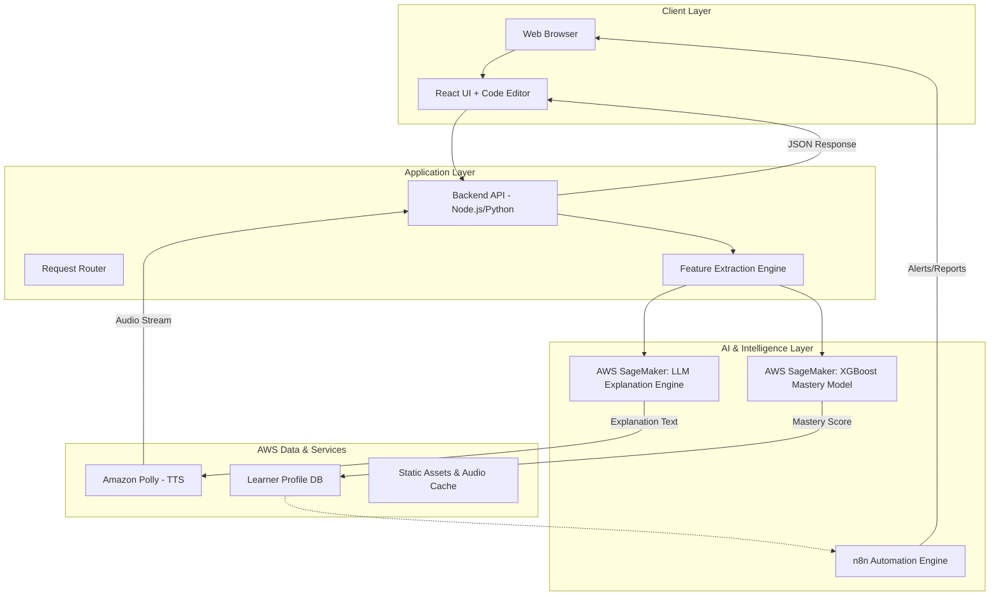

# Design Document: Cognitive Programming Mentor

## Overview

**Team Name:** EliteNova  
**Project:** Cognitive Programming Intelligence System

The Cognitive Programming Mentor is a hybrid AI-powered educational platform designed to bridge the employability gap for engineering graduates in Tier-2 and Tier-3 cities in India. The system addresses the lack of personalized mentorship and language barriers by providing a "Cognitive Digital Twin" mentor.

The application utilizes a React-based frontend for real-time code interaction, a Node.js/Python backend for orchestration, and AWS Cloud services (SageMaker, DynamoDB, Polly) to deliver adaptive, multilingual explanations. Key differentiators include an XGBoost-based mastery prediction model and an event-driven automation layer using n8n.

### Key Design Principles

1. **Cognitive Modeling**: The system does not just correct syntax; it models learner cognition to detect conceptual gaps using a hybrid approach (LLM + XGBoost)
2. **Closed-Loop Feedback**: Every interaction updates the learner's mastery profile in real-time to refine future explanations
3. **Multilingual Accessibility**: Overcoming language barriers via localized text and voice explanations (Tamil, Hindi, Telugu, Bengali, English)
4. **Scalability**: A cloud-native architecture using serverless and managed AWS services to handle high concurrency
5. **Automation First**: Utilizing n8n for intelligent alerts, progress reporting, and automated interventions
6. **Responsive-First**: Mobile-first CSS approach with progressive enhancement for larger screens
7. **Performance**: Lazy loading, code splitting, and caching strategies for optimal load times
8. **Accessibility**: WCAG-compliant color contrast, keyboard navigation, and semantic HTML

## Architecture

### System Architecture Diagram



### Technology Stack

**Frontend:**
- React 18.x for UI components
- React Router for client-side routing
- Axios for HTTP requests
- Tailwind CSS v4 for styling
- Framer Motion for animations
- Code Editor integration (Monaco/CodeMirror)

**Backend:**
- Node.js 18.x runtime (API Gateway/Routing)
- Python 3.x (Data Processing & Feature Extraction)
- Express.js for API framework
- AWS SDK v3 for service integration

**AI & Machine Learning (AWS):**
- **Model Hosting**: AWS SageMaker
- **LLM**: Transformer-based models (Google Gemini) for explanation generation
- **Predictive Model**: XGBoost for mastery prediction and weakness detection
- **Text-to-Speech**: Amazon Polly (multilingual support)

**Automation:**
- **n8n**: Workflow engine for alerts, reports, and automated interventions

**Data & Infrastructure:**
- **Database**: Amazon DynamoDB (NoSQL for learner profiles)
- **Storage**: Amazon S3 (static assets, audio cache)
- **Compute**: AWS Lambda/EC2 for serverless/scalable compute

**Development Tools:**
- Vite for frontend build tooling
- ESLint and Prettier for code quality
- Vitest and React Testing Library for testing
- fast-check for property-based testing

## Components and Interfaces

### Frontend Components

#### 1. CodingWorkspace Component (LearningInterface)

**Responsibility**: The primary interface where students write code and receive AI-powered feedback

**Props**: 
- `userId`: string (authenticated user ID)

**State**:
- `code`: string (user's code input)
- `explanation`: string (AI-generated explanation)
- `selectedLanguage`: string (language code for explanations)
- `programmingLanguage`: string (code language: Python, JavaScript, etc.)
- `audioUrl`: string (Polly audio URL)
- `isLoading`: boolean
- `masteryScore`: number (XGBoost prediction)
- `conceptualGap`: string (detected weakness)

**Key Elements**:
- CodeEditor: Syntax-highlighted input area with multi-language support
- LanguageToggle: Dropdown to select explanation language (Tamil, Hindi, Telugu, Bengali, English)
- MentorPanel: Displays the AI explanation with edit capability and plays Polly audio
- MasteryIndicator: Shows current mastery score and detected conceptual gaps

```javascript
// Component structure
<CodingWorkspace userId={userId}>
  <Header>
    <h1>AI Programming Mentor</h1>
    <MasteryIndicator score={masteryScore} gap={conceptualGap} />
  </Header>
  <MainLayout>
    <LanguageSelector 
      value={selectedLanguage}
      onChange={handleLanguageChange}
      options={['en-IN', 'hi-IN', 'ta-IN', 'te-IN', 'bn-IN']}
    />
    <ProgrammingLanguageSelector
      value={programmingLanguage}
      onChange={setProgrammingLanguage}
    />
    <CodeEditor
      value={code}
      onChange={setCode}
      onSubmit={handleCodeSubmit}
      language={programmingLanguage}
    />
    <MentorPanel
      isLoading={isLoading}
      explanation={explanation}
      audioUrl={audioUrl}
      language={selectedLanguage}
      onExplanationChange={setExplanation}
    />
    <VoicePlayer
      audioUrl={audioUrl}
      onPlay={handlePlayAudio}
      isEnabled={!!audioUrl}
    />
  </MainLayout>
</CodingWorkspace>
```

**Key Methods**:
- `handleCodeSubmit()`: Sends code to hybrid AI analysis (LLM + XGBoost)
- `handleLanguageChange(lang)`: Updates language preference and triggers closed-loop feedback
- `handlePlayAudio()`: Plays audio explanation via Polly
- `updateMasteryScore()`: Updates local mastery display from XGBoost prediction

#### 2. MasteryDashboard Component

**Responsibility**: Visualizes the student's skill deficits and progress over time

**Props**:
- `userId`: string
- `masteryData`: object (skill scores by topic)

**State**:
- `selectedTopic`: string
- `timeRange`: string ('week', 'month', 'all')

**Key Elements**:
- SkillGraph: Visual representation of mastery per topic (Arrays, Loops, Recursion, etc.)
- ProgressStats: Metrics on "Time to Solve" and "Error Frequency"
- InterventionAlerts: Notifications generated by n8n workflows
- TrendChart: Historical mastery score progression

```javascript
<MasteryDashboard userId={userId}>
  <DashboardHeader>
    <h2>Your Learning Progress</h2>
    <TimeRangeSelector value={timeRange} onChange={setTimeRange} />
  </DashboardHeader>
  <SkillGraph
    data={masteryData}
    onTopicSelect={setSelectedTopic}
  />
  <ProgressStats
    timeToSolve={stats.avgTime}
    errorFrequency={stats.errors}
    improvementRate={stats.improvement}
  />
  <InterventionAlerts
    alerts={n8nAlerts}
    onDismiss={handleAlertDismiss}
  />
  <TrendChart
    data={historicalData}
    selectedTopic={selectedTopic}
  />
</MasteryDashboard>
```

#### 4. ExplanationDisplay Component

**Responsibility**: Displays AI-generated explanations with formatting

**Props**:
- `explanation`: string
- `isLoading`: boolean

**Features**:
- Markdown rendering for formatted explanations
- Loading skeleton during API calls
- Smooth fade-in animation

#### 5. VoicePlayer Component

**Responsibility**: Audio playback controls for voice explanations

**Props**:
- `audioUrl`: string
- `onPlay`: function
- `isEnabled`: boolean

**Features**:
- Play/pause button
- Progress indicator
- Volume control

#### 6. Navigation Component

**Responsibility**: Site-wide navigation bar

**Props**: None

**Features**:
- Responsive hamburger menu for mobile
- Smooth scroll to sections
- Active link highlighting

### Backend API Endpoints

#### 1. POST /api/v1/analyze

**Purpose**: Orchestrates the hybrid AI analysis (LLM + XGBoost) for code explanation and mastery prediction

**Request Body**:
```json
{
  "userId": "usr_123",
  "code": "def mystery(nums): return sum(nums) / len(nums)",
  "language": "python",
  "preferredLanguage": "ta-IN"
}
```

**Response**:
```json
{
  "explanation": "இந்தக் கோடு எண்களின் சராசரியைக் கணக்கிடுகிறது...",
  "masteryScore": 0.85,
  "audioUrl": "https://s3.aws.com/polly-stream-id",
  "conceptualGapDetected": "Loop Termination",
  "timestamp": "ISO8601 string",
  "interactionId": "int_999"
}
```

**Process**:
1. Extract features from code (error frequency, time-to-solve, complexity metrics)
2. Send features to XGBoost model on SageMaker for mastery prediction
3. Generate explanation using LLM (Google Gemini via SageMaker)
4. Translate explanation to preferred language if needed
5. Convert explanation to speech using Amazon Polly
6. Store interaction in DynamoDB for closed-loop feedback
7. Trigger n8n webhook if mastery score below threshold
8. Return comprehensive response

#### 2. POST /api/v1/feedback/loop

**Purpose**: Closes the learning loop by updating the mastery model based on user reaction/success

**Request Body**:
```json
{
  "userId": "usr_123",
  "interactionId": "int_999",
  "comprehensionRating": 5,
  "timeSpent": 45,
  "codeImproved": true,
  "conceptMastered": "Loop Termination"
}
```

**Response**:
```json
{
  "success": true,
  "updatedMasteryScore": 0.88,
  "message": "Feedback recorded successfully"
}
```

**Process**:
1. Validate interaction ID and user ID
2. Update learner profile in DynamoDB with feedback metrics
3. Recalculate mastery score using updated data
4. Trigger n8n workflow if significant improvement detected
5. Return updated mastery score

#### 2. POST /api/synthesize-speech

**Purpose**: Convert explanation text to speech using Amazon Polly

**Request Body**:
```json
{
  "text": "string",
  "languageCode": "string",
  "voiceId": "string"
}
```

**Response**:
```json
{
  "audioUrl": "string",
  "duration": "number"
}
```

**Process**:
1. Validate text and language parameters
2. Call Amazon Polly synthesizeSpeech API
3. Return presigned URL for audio stream
4. Cache audio for repeated requests

#### 3. POST /api/users

**Purpose**: Create new user profile

**Request Body**:
```json
{
  "email": "string",
  "name": "string",
  "preferredLanguage": "string"
}
```

**Response**:
```json
{
  "userId": "string",
  "profile": {
    "email": "string",
    "name": "string",
    "preferredLanguage": "string",
    "createdAt": "ISO8601 string"
  }
}
```

#### 4. GET /api/users/:userId

**Purpose**: Retrieve user profile and progress

**Response**:
```json
{
  "userId": "string",
  "profile": {
    "email": "string",
    "name": "string",
    "preferredLanguage": "string"
  },
  "progress": {
    "totalSessions": "number",
    "lastActive": "ISO8601 string",
    "completedTopics": ["string"]
  }
}
```

#### 5. PUT /api/users/:userId/progress

**Purpose**: Update user learning progress

**Request Body**:
```json
{
  "activity": "string",
  "metadata": "object"
}
```

**Response**:
```json
{
  "success": "boolean",
  "updatedProgress": "object"
}
```

### AWS Service Integration

#### AWS SageMaker & XGBoost Integration

**Service**: Predictive Weakness Detection and Mastery Scoring

**Implementation**:

Feature extraction logic (in Python) calculates metrics from code submissions:
- Error Frequency: Number of syntax/logic errors per session
- Time-to-Solve: Duration from problem start to correct solution
- Code Complexity: Cyclomatic complexity, lines of code
- Attempt Count: Number of submissions before success
- Concept Coverage: Which programming concepts were used

These features are sent to the XGBoost model hosted on SageMaker to predict a MasteryScore (0.0 to 1.0).

```python
# Feature extraction example
def extract_features(user_history, current_code):
    features = {
        'error_frequency': calculate_error_rate(user_history),
        'time_to_solve': get_session_duration(user_history),
        'complexity_score': analyze_code_complexity(current_code),
        'attempt_count': len(user_history['attempts']),
        'concept_coverage': identify_concepts(current_code)
    }
    return features

# SageMaker endpoint invocation
response = sagemaker_runtime.invoke_endpoint(
    EndpointName='xgboost-mastery-predictor',
    ContentType='application/json',
    Body=json.dumps(features)
)

mastery_score = json.loads(response['Body'].read())['predictions'][0]
```

**Model Training**:
- Training Data: Historical learner interactions with labeled mastery outcomes
- Features: 15+ engineered features from code submissions and user behavior
- Target: Binary classification (mastered/not mastered) or regression (mastery score 0-1)
- Validation: Cross-validation with 80/20 train-test split

#### Amazon Polly Integration

**Service**: Multilingual Voice Synthesis

**Implementation**:
```javascript
const pollyParams = {
  Text: translatedExplanation,
  OutputFormat: 'mp3',
  VoiceId: 'Aditi', // Bilingual support for Indian languages
  LanguageCode: req.body.preferredLanguage, // e.g., 'hi-IN', 'ta-IN'
  Engine: 'neural'
};

const command = new SynthesizeSpeechCommand(pollyParams);
const response = await pollyClient.send(command);

// Stream audio to S3 for caching
const audioKey = `audio/${userId}/${interactionId}.mp3`;
await s3Client.putObject({
  Bucket: 'cognitive-mentor-audio',
  Key: audioKey,
  Body: response.AudioStream,
  ContentType: 'audio/mpeg'
});

// Return presigned URL to frontend
const audioUrl = await getSignedUrl(s3Client, new GetObjectCommand({
  Bucket: 'cognitive-mentor-audio',
  Key: audioKey
}), { expiresIn: 3600 });

return audioUrl;
```

**Voice Mapping**:
- `en-IN`: Aditi (female) or Raveena (female)
- `hi-IN`: Aditi (supports Hindi)
- `ta-IN`: Aditi with SSML phonetic pronunciation
- `te-IN`: Aditi with SSML phonetic pronunciation
- `bn-IN`: Aditi with SSML phonetic pronunciation

#### n8n Automation Integration

**Service**: Event-Driven Interventions and Automated Reporting

**Implementation**:

Webhook triggers from the Backend API when specific conditions are met:

```javascript
// Trigger n8n workflow when mastery score drops below threshold
if (masteryScore < MASTERY_THRESHOLD) {
  await axios.post(process.env.N8N_WEBHOOK_URL, {
    event: 'low_mastery_alert',
    userId: userId,
    masteryScore: masteryScore,
    conceptualGap: conceptualGapDetected,
    timestamp: new Date().toISOString()
  });
}

// Trigger weekly progress report
if (isEndOfWeek()) {
  await axios.post(process.env.N8N_WEBHOOK_URL, {
    event: 'weekly_progress_report',
    userId: userId,
    weeklyStats: calculateWeeklyStats(userId)
  });
}
```

**n8n Workflows**:

1. **Low Mastery Alert Workflow**:
   - Trigger: Mastery score < 0.6
   - Actions:
     - Send email notification to student
     - Create UI alert with remedial lesson suggestions
     - Log intervention in DynamoDB
     - Schedule follow-up check in 48 hours

2. **Weekly Progress Report Workflow**:
   - Trigger: Every Sunday at 6 PM
   - Actions:
     - Aggregate weekly learning metrics
     - Generate progress visualization
     - Send email report with achievements and areas for improvement
     - Update dashboard with weekly summary

3. **Concept Mastery Celebration Workflow**:
   - Trigger: Mastery score increases by > 0.2 in single session
   - Actions:
     - Send congratulatory notification
     - Award achievement badge
     - Suggest next learning challenge

**Fallback Handling**:
If the n8n webhook is unreachable, the API logs the event to a "PendingNotifications" queue (AWS SQS) to be retried later, ensuring the student eventually receives their progress report.

#### Amazon DynamoDB Integration

**Tables**:

1. **Users Table**
   - Partition Key: `userId` (String)
   - Attributes: `email`, `name`, `preferredLanguage`, `createdAt`, `currentMasteryScore`, `totalSessions`

2. **LearningProgress Table**
   - Partition Key: `userId` (String)
   - Sort Key: `timestamp` (Number)
   - Attributes: `activity`, `codeSubmitted`, `explanationGenerated`, `languageUsed`, `masteryScore`, `conceptualGap`, `timeSpent`, `comprehensionRating`, `interactionId`
   - GSI: `interactionId-index` for quick lookup by interaction

3. **Sessions Table**
   - Partition Key: `sessionId` (String)
   - Attributes: `userId`, `startTime`, `endTime`, `interactionsCount`, `averageMasteryScore`, `conceptsCovered`

4. **MasteryScores Table** (New)
   - Partition Key: `userId` (String)
   - Sort Key: `concept` (String)
   - Attributes: `score`, `lastUpdated`, `attemptCount`, `successRate`, `trend`

**Implementation**:
```javascript
import { DynamoDBClient } from "@aws-sdk/client-dynamodb";
import { DynamoDBDocumentClient, PutCommand, GetCommand, UpdateCommand, QueryCommand } from "@aws-sdk/lib-dynamodb";

const client = new DynamoDBClient({ region: "ap-south-1" });
const docClient = DynamoDBDocumentClient.from(client);

// Store interaction with mastery score
async function recordInteraction(interactionData) {
  const params = {
    TableName: "LearningProgress",
    Item: {
      userId: interactionData.userId,
      timestamp: Date.now(),
      interactionId: interactionData.interactionId,
      codeSubmitted: interactionData.code,
      explanationGenerated: interactionData.explanation,
      languageUsed: interactionData.language,
      masteryScore: interactionData.masteryScore,
      conceptualGap: interactionData.conceptualGap,
      timeSpent: interactionData.timeSpent
    }
  };
  
  await docClient.send(new PutCommand(params));
  
  // Update user's current mastery score
  await updateUserMasteryScore(interactionData.userId, interactionData.masteryScore);
}

// Update mastery score for specific concept
async function updateConceptMastery(userId, concept, newScore) {
  const params = {
    TableName: "MasteryScores",
    Key: { userId, concept },
    UpdateExpression: "SET score = :score, lastUpdated = :timestamp, attemptCount = attemptCount + :inc",
    ExpressionAttributeValues: {
      ":score": newScore,
      ":timestamp": Date.now(),
      ":inc": 1
    }
  };
  
  await docClient.send(new UpdateCommand(params));
}

// Query user's learning history for feature extraction
async function getUserHistory(userId, limit = 50) {
  const params = {
    TableName: "LearningProgress",
    KeyConditionExpression: "userId = :userId",
    ExpressionAttributeValues: {
      ":userId": userId
    },
    Limit: limit,
    ScanIndexForward: false // Most recent first
  };
  
  const result = await docClient.send(new QueryCommand(params));
  return result.Items;
}
```

## Data Models

### User Profile Model

```typescript
interface UserProfile {
  userId: string;
  email: string;
  name: string;
  preferredLanguage: string;
  createdAt: string;
  lastActive?: string;
}
```

### Learning Activity Model

```typescript
interface LearningActivity {
  userId: string;
  timestamp: number;
  activity: 'code_submission' | 'explanation_viewed' | 'audio_played';
  codeSubmitted?: string;
  explanationGenerated?: string;
  languageUsed: string;
  metadata?: Record<string, any>;
}
```

### Explanation Request Model

```typescript
interface ExplanationRequest {
  code: string;
  language: string;
  userId: string;
}
```

### Speech Synthesis Request Model

```typescript
interface SpeechSynthesisRequest {
  text: string;
  languageCode: string;
  voiceId: string;
}
```

### API Response Model

```typescript
interface APIResponse<T> {
  success: boolean;
  data?: T;
  error?: {
    code: string;
    message: string;
  };
  timestamp: string;
}
```

## Correctness Properties

*A property is a characteristic or behavior that should hold true across all valid executions of a system—essentially, a formal statement about what the system should do. Properties serve as the bridge between human-readable specifications and machine-verifiable correctness guarantees.*

### Property Reflection

The system emphasizes "Closed-Loop Learning" and "Cognitive Modeling". Therefore, correctness depends heavily on the synchronization between the user's actions, the database updates, and the subsequent adaptation of the AI. The hybrid approach (LLM + XGBoost) requires properties that validate both the AI explanation quality and the mastery prediction accuracy.

### Correctness Properties

#### Property 1: Explanation Language Consistency

*For any* code submission accompanied by a specific language preference (e.g., Tamil), the returned textual explanation and the audio stream (via Polly) must utilize that specific language code.

**Validates: Requirements 4.1, 4.2, 4.4**

#### Property 2: Mastery Score Monotonicity (Local)

*For any* successful learning session where a concept is mastered (indicated by correct code submission after failure), the specific concept's mastery score in DynamoDB must reflect a non-negative update.

**Validates: Requirements 5.2, 5.3**

#### Property 3: Closed-Loop Persistence

*For any* interaction cycle (Code Submit → Explanation → User Action), a record must be written to the LearnerProfile table in DynamoDB to ensure the "Closed-Loop Feedback" mechanism has historical data for future predictions.

**Validates: Requirements 5.1, 5.3, 5.4**

#### Property 4: Automation Trigger Validity

*For any* mastery score update that falls below the critical threshold (defined in config), the system must emit an event to the n8n webhook endpoint.

**Validates: Requirements 11.6 (new), 12.7 (new)**

#### Property 5: Response Latency (UX)

*For any* code analysis request, the combined latency of Feature Extraction + XGBoost Prediction + LLM Generation + Polly Synthesis should not exceed 5 seconds to maintain user engagement.

**Validates: Requirements 11.1, 11.2**

#### Property 6: XGBoost Prediction Consistency

*For any* set of extracted features from user code, the XGBoost model must return a mastery score between 0.0 and 1.0, and the prediction must be deterministic for identical feature sets.

**Validates: Requirements 13.1 (new)**

#### Property 7: Feature Extraction Completeness

*For any* code submission, the feature extraction engine must calculate all required metrics (error frequency, time-to-solve, complexity, attempt count, concept coverage) before invoking the XGBoost model.

**Validates: Requirements 13.2 (new)**

#### Property 8: n8n Workflow Execution

*For any* triggered n8n workflow (low mastery alert, progress report, etc.), the system must log the workflow execution status in DynamoDB for audit and retry purposes.

**Validates: Requirements 11.6 (new)**

#### Property 9: Audio Caching Efficiency

*For any* repeated explanation text in the same language, the system should retrieve the audio from S3 cache rather than regenerating via Polly, reducing latency and cost.

**Validates: Requirements 11.4**

#### Property 10: Conceptual Gap Detection Accuracy

*For any* code submission with errors, the system must identify at least one conceptual gap (e.g., "Loop Termination", "Array Indexing") based on error patterns and code analysis.

**Validates: Requirements 13.3 (new)**

## Error Handling

### AI & ML Layer Errors

**Low Confidence / Hallucination Risks:**
If the LLM generates an explanation with low probability (if detectable via logprobs), the system falls back to a template-based explanation for safety.

```javascript
if (llmResponse.confidence < CONFIDENCE_THRESHOLD) {
  return {
    explanation: "We analyzed your code but couldn't generate a specific verbal explanation. Here are standard docs for this syntax.",
    fallbackUsed: true,
    originalConfidence: llmResponse.confidence
  };
}
```

**SageMaker Timeout:**
If the XGBoost model endpoint is cold/unresponsive, the system proceeds with the LLM explanation only, logging the failure to update the mastery score for later reconciliation.

```javascript
try {
  const masteryScore = await invokeSageMakerEndpoint(features);
} catch (error) {
  console.error('XGBoost endpoint timeout:', error);
  // Log for later reconciliation
  await logMasteryScoreFailure(userId, interactionId, features);
  // Continue with LLM explanation
  masteryScore = null; // Will be calculated offline
}
```

**Feature Extraction Errors:**
If code analysis fails due to syntax errors or unsupported language features, provide graceful degradation:

```javascript
try {
  const features = extractFeatures(code, language);
} catch (error) {
  console.error('Feature extraction failed:', error);
  return {
    explanation: "We detected syntax errors in your code. Please fix them and try again.",
    syntaxErrors: error.details,
    masteryScore: null
  };
}
```

### Automation Failures (n8n)

**Webhook Failures:**
If the n8n webhook is unreachable, the API logs the event to a "PendingNotifications" queue (SQS) to be retried later, ensuring the student eventually gets their progress report.

```javascript
try {
  await axios.post(N8N_WEBHOOK_URL, eventData, { timeout: 5000 });
} catch (error) {
  console.error('n8n webhook failed:', error);
  // Queue for retry
  await sqs.sendMessage({
    QueueUrl: PENDING_NOTIFICATIONS_QUEUE,
    MessageBody: JSON.stringify({
      event: eventData,
      retryCount: 0,
      timestamp: Date.now()
    })
  });
}
```

### Frontend Error Handling

**Network Errors:**
- Display user-friendly message: "Unable to connect. Please check your internet connection."
- Provide retry button
- Log error details to console for debugging

**API Errors:**
- Parse error response from backend
- Display specific error message from API
- Fallback to generic message if error format is unexpected

**Validation Errors:**
- Highlight invalid fields in red
- Display inline validation messages
- Prevent form submission until errors are resolved

**Component Errors:**
- Implement React Error Boundaries
- Display fallback UI when component crashes
- Log error to error tracking service (e.g., Sentry)

### Backend Error Handling

**AWS Service Errors:**
```javascript
try {
  const result = await pollyClient.send(command);
  return result;
} catch (error) {
  if (error.name === 'ThrottlingException') {
    return { error: 'Service temporarily unavailable. Please try again.' };
  } else if (error.name === 'InvalidParameterException') {
    return { error: 'Invalid request parameters.' };
  } else {
    logger.error('Polly error:', error);
    return { error: 'Text-to-speech service error.' };
  }
}
```

**Database Errors:**
```javascript
try {
  const result = await docClient.send(new PutCommand(params));
  return result;
} catch (error) {
  if (error.name === 'ConditionalCheckFailedException') {
    return { error: 'Resource already exists.' };
  } else if (error.name === 'ProvisionedThroughputExceededException') {
    return { error: 'Service busy. Please try again.' };
  } else {
    logger.error('DynamoDB error:', error);
    return { error: 'Database operation failed.' };
  }
}
```

**Validation Errors:**
```javascript
function validateExplanationRequest(req, res, next) {
  const { code, language, userId } = req.body;
  
  if (!code || typeof code !== 'string' || code.trim().length === 0) {
    return res.status(400).json({
      success: false,
      error: { code: 'INVALID_CODE', message: 'Code is required.' }
    });
  }
  
  if (!language || !SUPPORTED_LANGUAGES.includes(language)) {
    return res.status(400).json({
      success: false,
      error: { code: 'INVALID_LANGUAGE', message: 'Unsupported language.' }
    });
  }
  
  if (!userId) {
    return res.status(401).json({
      success: false,
      error: { code: 'UNAUTHORIZED', message: 'User authentication required.' }
    });
  }
  
  next();
}
```

**Global Error Handler:**
```javascript
app.use((error, req, res, next) => {
  logger.error('Unhandled error:', error);
  
  res.status(error.status || 500).json({
    success: false,
    error: {
      code: error.code || 'INTERNAL_ERROR',
      message: error.message || 'An unexpected error occurred.'
    },
    timestamp: new Date().toISOString()
  });
});
```

## Testing Strategy

### Dual Testing Approach

The testing strategy employs both unit tests and property-based tests to ensure comprehensive coverage:

**Unit Tests**: Focus on specific examples, edge cases, and integration points between components. Unit tests verify concrete scenarios and are useful for regression testing.

**Property-Based Tests**: Verify universal properties that should hold for all inputs. These tests generate many random inputs to validate correctness properties defined in this document. Property-based tests catch edge cases that developers might not think to test manually.

Together, unit tests and property-based tests provide complementary coverage: unit tests catch concrete bugs in specific scenarios, while property-based tests verify general correctness across the input space.

### Property-Based Testing Configuration

**Library Selection:**
- **Frontend (JavaScript/React)**: Use `fast-check` library for property-based testing
- **Backend (Node.js/Python)**: Use `fast-check` (Node.js) or `Hypothesis` (Python) for property-based testing

**Test Configuration:**
- Each property test MUST run a minimum of 100 iterations
- Each property test MUST include a comment tag referencing the design document property
- Tag format: `// Feature: cognitive-programming-mentor, Property {number}: {property_text}`

**Example Property Tests:**

```javascript
import fc from 'fast-check';

// Feature: cognitive-programming-mentor, Property 1: Explanation Language Consistency
test('API response matches requested language code', async () => {
  await fc.assert(
    fc.asyncProperty(
      fc.constantFrom('en-IN', 'hi-IN', 'ta-IN', 'te-IN', 'bn-IN'), // Language inputs
      fc.string({ minLength: 10, maxLength: 500 }), // Code inputs
      async (lang, code) => {
        const response = await api.analyze({ 
          language: 'python', 
          preferredLanguage: lang, 
          code,
          userId: 'test_user'
        });
        
        // Assert response metadata tags the content with the same language
        expect(response.meta.language).toEqual(lang);
        // Assert Polly audio URL contains the language code
        expect(response.audioUrl).toContain(lang);
      }
    ),
    { numRuns: 100 }
  );
});

// Feature: cognitive-programming-mentor, Property 3: Closed-Loop Persistence
test('Every analysis request updates the database', async () => {
  await fc.assert(
    fc.asyncProperty(
      fc.record({ 
        userId: fc.uuid(), 
        code: fc.string({ minLength: 10, maxLength: 200 }),
        language: fc.constantFrom('python', 'javascript', 'java')
      }),
      async (payload) => {
        const initialDbState = await db.getProfile(payload.userId);
        await api.analyze(payload);
        const finalDbState = await db.getProfile(payload.userId);
        
        // The last interaction timestamp must be greater than before
        expect(finalDbState.lastInteraction).toBeGreaterThan(
          initialDbState.lastInteraction || 0
        );
        
        // Total sessions count must increase
        expect(finalDbState.totalSessions).toBeGreaterThan(
          initialDbState.totalSessions || 0
        );
      }
    ),
    { numRuns: 100 }
  );
});

// Feature: cognitive-programming-mentor, Property 6: XGBoost Prediction Consistency
test('XGBoost returns deterministic scores for identical features', async () => {
  await fc.assert(
    fc.asyncProperty(
      fc.record({
        errorFrequency: fc.float({ min: 0, max: 1 }),
        timeToSolve: fc.integer({ min: 1, max: 3600 }),
        complexityScore: fc.float({ min: 0, max: 100 }),
        attemptCount: fc.integer({ min: 1, max: 50 })
      }),
      async (features) => {
        const score1 = await invokeSageMakerEndpoint(features);
        const score2 = await invokeSageMakerEndpoint(features);
        
        // Scores must be identical for same features
        expect(score1).toEqual(score2);
        // Score must be between 0 and 1
        expect(score1).toBeGreaterThanOrEqual(0);
        expect(score1).toBeLessThanOrEqual(1);
      }
    ),
    { numRuns: 100 }
  );
});
```

### Unit Testing Strategy

**Frontend Unit Tests:**
- Component rendering tests (React Testing Library)
- User interaction tests (click, input, navigation)
- State management tests
- API integration tests (mocked)
- Edit functionality tests for ExplanationDisplay

**Backend Unit Tests:**
- API endpoint tests (request/response validation)
- AWS service integration tests (mocked SDK calls)
- Feature extraction logic tests
- XGBoost prediction tests (mocked SageMaker)
- n8n webhook trigger tests
- Data validation tests
- Error handling tests

**Integration Tests:**
- End-to-end user flows
- Frontend-backend communication
- AWS service integration (using localstack or mocks)
- Closed-loop feedback cycle validation

### Integration Testing

**End-to-End Flow**: 
Simulate a user logging in, submitting incorrect code (triggering XGBoost weakness detection), receiving a Tamil explanation (Polly), and correcting the code. Verify the Mastery Score increased in DynamoDB.

```javascript
test('Complete learning cycle updates mastery score', async () => {
  const userId = 'test_user_123';
  
  // Step 1: Submit incorrect code
  const incorrectResponse = await api.analyze({
    userId,
    code: 'def avg(nums): return sum(nums)', // Missing division
    language: 'python',
    preferredLanguage: 'ta-IN'
  });
  
  expect(incorrectResponse.conceptualGapDetected).toBe('Division Operation');
  const initialMastery = incorrectResponse.masteryScore;
  
  // Step 2: Submit corrected code
  const correctResponse = await api.analyze({
    userId,
    code: 'def avg(nums): return sum(nums) / len(nums)',
    language: 'python',
    preferredLanguage: 'ta-IN'
  });
  
  // Step 3: Verify mastery improved
  expect(correctResponse.masteryScore).toBeGreaterThan(initialMastery);
  
  // Step 4: Verify database updated
  const userProfile = await db.getProfile(userId);
  expect(userProfile.currentMasteryScore).toEqual(correctResponse.masteryScore);
  
  // Step 5: Verify n8n webhook triggered if threshold crossed
  if (correctResponse.masteryScore > MASTERY_THRESHOLD) {
    const webhookLogs = await db.getWebhookLogs(userId);
    expect(webhookLogs).toContainEqual(
      expect.objectContaining({ event: 'concept_mastery_celebration' })
    );
  }
});
```

### Test Coverage Goals

- Minimum 80% code coverage for backend
- Minimum 70% code coverage for frontend
- 100% coverage of API endpoints
- 100% coverage of error handling paths
- All correctness properties implemented as property-based tests

### Testing Tools

**Frontend:**
- Jest: Test runner
- React Testing Library: Component testing
- fast-check: Property-based testing
- MSW (Mock Service Worker): API mocking

**Backend:**
- Jest: Test runner
- Supertest: API endpoint testing
- fast-check: Property-based testing
- aws-sdk-mock: AWS service mocking

### Continuous Integration

- Run all tests on every pull request
- Block merges if tests fail
- Generate coverage reports
- Run property-based tests with increased iterations (1000+) in CI environment
